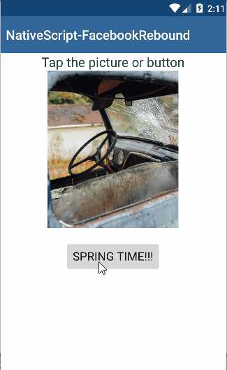

[](https://www.npmjs.com/package/nativescript-facebookrebound)
[](https://www.npmjs.com/package/nativescript-facebookrebound)

# nativescript-facebookrebound :basketball:
NativeScript plugin to provide access to Facebook's Spring Animations for Android.
This is just a simple wrapper to remove some of the complexity of Rebound, if you want to provide more "sugar"
on the native methods in the Rebound library then submit a PR :)

### FacebookRebound Usage 


## Installation
`npm install nativescript-facebookrebound`

## Usage

Typically, you'll want to attach a Spring during the `loaded` event for your view item
### XML:
```XML
 <Image tap="springThis" height="240" loaded="picLoaded" src="~/images/deadpool2.jpg" stretch="aspectFit" />
```
 
### JS:
```JS
var rebound = require("nativescript-facebookrebound");


function picLoaded (args) {

    // Getting the native android view (android.view.ImageView in this example)
    var view = args.object.android;

    // create a Rebound Spring() ( TENSION, FRICTION ) -- @returns a Spring() if successful
    rebound.createSpring(500, 10).then(function (result) {

        // Now we have a Spring to work with.
        Spring = result;       

        // called whenever the spring is updated
        rebound.onSpringUpdate(function () {
            var mappedValue = com.facebook.rebound.SpringUtil.mapValueFromRangeToRange(Spring.getCurrentValue(), 0, 1, 1, 0.5);
            view.setScaleX(mappedValue);
            view.setScaleY(mappedValue);
        });

        // called whenever the spring leaves its resting state
        rebound.onSpringActivate(function () {
            console.log('setSpringActivate started...');
        });

        // called whenever the spring notifies of displacement state changes
        rebound.onSpringAtEndState(function () {
            console.log('setSpringAtEndState...');
        });

        // called whenever the spring achieves a resting state
        rebound.onSpringAtRest(function () {
            console.log('setSpringAtRest...');
            // Here you could do something like hide a view or trigger more spring if you wanted...
        });

    }, function (err) {
        alert("Error in rebound.createSpring(): " + err);
    });
}
exports.picLoaded = picLoaded;


function springThis(args) {
    // quick boolean to check if we are going up or down
    if (mMovedUp) {
        // setEndValue():  set the rest value to determine the displacement for the spring
        Spring.setEndValue(0);
    } else {
        Spring.setEndValue(1);
    }
    mMovedUp = !mMovedUp;
}
exports.springThis = springThis;
```

### API

* **createSpring**(tension: number, friction: damper) Promise...
    * returns - Spring()

#### Once you have a Spring returned from *createSpring()*, you set your callbacks for the listener events:

* **onSpringUpdate**(function)
* **onSpringActivate**(function)
* **onSpringAtEndState**(function)
* **onSpringAtRest**(function)
